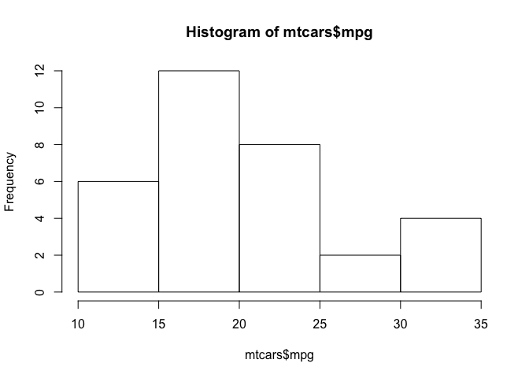

# Working with data frames in R (1)
Matt O'Donnell  
Jan 22, 2016  


## What are data frames?

Data frames are tables that hold data that consist of __rows__ and __columns__, just like a spreadsheet. They are most likely the primary way you will access, manipulate and plot your data from while using R.

R includes a series of included data sets that you can find in the datasets library. Type `library(help='datasets')` to see a list of what is there. To get started we'll use the __mtcars__ dataset, which you can find out about by typing `?mtcars`.

> The data was extracted from the 1974 Motor Trend US magazine, and comprises fuel consumption and 10 aspects of automobile design and performance for 32 automobiles (1973–74 models).

Load the data into your workspace with `data(mtcars)`


```r
data(mtcars)
head(mtcars)   # this will show you the first 6 rows by default
```

```
##                    mpg cyl disp  hp drat    wt  qsec vs am gear carb
## Mazda RX4         21.0   6  160 110 3.90 2.620 16.46  0  1    4    4
## Mazda RX4 Wag     21.0   6  160 110 3.90 2.875 17.02  0  1    4    4
## Datsun 710        22.8   4  108  93 3.85 2.320 18.61  1  1    4    1
## Hornet 4 Drive    21.4   6  258 110 3.08 3.215 19.44  1  0    3    1
## Hornet Sportabout 18.7   8  360 175 3.15 3.440 17.02  0  0    3    2
## Valiant           18.1   6  225 105 2.76 3.460 20.22  1  0    3    1
```

Data frames are tables like a spreadsheet where rows are 'observations' (e.g. subjects, trials, messages) and columns are 'variables' (e.g. measured characteristics, features)

You can also see the whole data by typing `mtcars`. `head` and `tail` will give you the first and last __n__ rows, e.g.


```r
head(mtcars,3)  # first three rows
```

```
##                mpg cyl disp  hp drat    wt  qsec vs am gear carb
## Mazda RX4     21.0   6  160 110 3.90 2.620 16.46  0  1    4    4
## Mazda RX4 Wag 21.0   6  160 110 3.90 2.875 17.02  0  1    4    4
## Datsun 710    22.8   4  108  93 3.85 2.320 18.61  1  1    4    1
```


```r
tail(mtcars,3)  # last three rows
```

```
##                mpg cyl disp  hp drat   wt qsec vs am gear carb
## Ferrari Dino  19.7   6  145 175 3.62 2.77 15.5  0  1    5    6
## Maserati Bora 15.0   8  301 335 3.54 3.57 14.6  0  1    5    8
## Volvo 142E    21.4   4  121 109 4.11 2.78 18.6  1  1    4    2
```

### Get the names of the columns in a dataframe


```r
colnames(mtcars)
```

```
##  [1] "mpg"  "cyl"  "disp" "hp"   "drat" "wt"   "qsec" "vs"   "am"   "gear"
## [11] "carb"
```

### Get the values from a single column

1. by name


```r
mtcars$wt
```

```
##  [1] 2.620 2.875 2.320 3.215 3.440 3.460 3.570 3.190 3.150 3.440 3.440
## [12] 4.070 3.730 3.780 5.250 5.424 5.345 2.200 1.615 1.835 2.465 3.520
## [23] 3.435 3.840 3.845 1.935 2.140 1.513 3.170 2.770 3.570 2.780
```

2. by using indexing with the syntax <code>DF[row, column]</code> - indexing starts from 1 and leaving either 'row' or 'column' blank will get all values in that row or column


```r
mtcars[,1]  # gets the first column
```

```
##  [1] 21.0 21.0 22.8 21.4 18.7 18.1 14.3 24.4 22.8 19.2 17.8 16.4 17.3 15.2
## [15] 10.4 10.4 14.7 32.4 30.4 33.9 21.5 15.5 15.2 13.3 19.2 27.3 26.0 30.4
## [29] 15.8 19.7 15.0 21.4
```

which is the same as


```r
mtcars$mpg
```

```
##  [1] 21.0 21.0 22.8 21.4 18.7 18.1 14.3 24.4 22.8 19.2 17.8 16.4 17.3 15.2
## [15] 10.4 10.4 14.7 32.4 30.4 33.9 21.5 15.5 15.2 13.3 19.2 27.3 26.0 30.4
## [29] 15.8 19.7 15.0 21.4
```

ranges of rows or columns can be specified as:

* continous ranges, e.g. `df[1:5,]` means rows 1,2,3,4&5
* specific indices using c(), e.g. `df[c(1,3,5,11),]` means rows 1,3,5 & 11
* by a combination e.g., `df[c(1:3,7,11,15),]` means rows 1,2,3,7,11&15
* by column or rowname, e.g. `df[,c('mpg','wt)]` means columns 'mpg' and 'wt'


```r
mtcars[1:5,5] # get the data from the fifth column for the first five rows
```

```
## [1] 3.90 3.90 3.85 3.08 3.15
```

* Combining more than one row and more than one column when indexing a data frame will return another data frame. For example, this will get the __mpg__ and __wt__ columns for the 3rd, 5th, 7th and 9th rows of the __mtcars__ data frame.


```r
mtcars[c(3,5,7,9),c('mpg','wt')]
```

```
##                    mpg   wt
## Datsun 710        22.8 2.32
## Hornet Sportabout 18.7 3.44
## Duster 360        14.3 3.57
## Merc 230          22.8 3.15
```


## Summarizing columns in data frame

#### 1. Specific columns:


```r
summary(mtcars$mpg)
```

```
##    Min. 1st Qu.  Median    Mean 3rd Qu.    Max. 
##   10.40   15.42   19.20   20.09   22.80   33.90
```


```r
summary(mtcars$gear)
```

```
##    Min. 1st Qu.  Median    Mean 3rd Qu.    Max. 
##   3.000   3.000   4.000   3.688   4.000   5.000
```


#### 2. All columns in data frame:


```r
summary(mtcars)
```

```
##       mpg             cyl             disp             hp       
##  Min.   :10.40   Min.   :4.000   Min.   : 71.1   Min.   : 52.0  
##  1st Qu.:15.43   1st Qu.:4.000   1st Qu.:120.8   1st Qu.: 96.5  
##  Median :19.20   Median :6.000   Median :196.3   Median :123.0  
##  Mean   :20.09   Mean   :6.188   Mean   :230.7   Mean   :146.7  
##  3rd Qu.:22.80   3rd Qu.:8.000   3rd Qu.:326.0   3rd Qu.:180.0  
##  Max.   :33.90   Max.   :8.000   Max.   :472.0   Max.   :335.0  
##       drat             wt             qsec             vs        
##  Min.   :2.760   Min.   :1.513   Min.   :14.50   Min.   :0.0000  
##  1st Qu.:3.080   1st Qu.:2.581   1st Qu.:16.89   1st Qu.:0.0000  
##  Median :3.695   Median :3.325   Median :17.71   Median :0.0000  
##  Mean   :3.597   Mean   :3.217   Mean   :17.85   Mean   :0.4375  
##  3rd Qu.:3.920   3rd Qu.:3.610   3rd Qu.:18.90   3rd Qu.:1.0000  
##  Max.   :4.930   Max.   :5.424   Max.   :22.90   Max.   :1.0000  
##        am              gear            carb      
##  Min.   :0.0000   Min.   :3.000   Min.   :1.000  
##  1st Qu.:0.0000   1st Qu.:3.000   1st Qu.:2.000  
##  Median :0.0000   Median :4.000   Median :2.000  
##  Mean   :0.4062   Mean   :3.688   Mean   :2.812  
##  3rd Qu.:1.0000   3rd Qu.:4.000   3rd Qu.:4.000  
##  Max.   :1.0000   Max.   :5.000   Max.   :8.000
```

## Plotting summary data

#### 1. Histogram


```r
hist(mtcars$mpg)
```



#### 2. Pair scatter plot - if your columns are all numeric or categorical you can do a pairwise plot


```r
plot(mtcars)
```


## Plotting relationships between variables

#### 1. using plot(x,y) and specifying each column


```r
plot(mtcars$wt, mtcars$mpg)
```


#### 2. using with()


```r
with(mtcars, plot(wt, mpg))
```


#### 3. using formula syntax - ``plot(y ~ x, data_frame)``


```r
plot(mpg ~ wt, mtcars)
```


## Correlations

- ``cor`` will calculate correlation between pairs of vectors


```r
cor(mtcars$wt, mtcars$mpg)
```

```
## [1] -0.8676594
```


```r
with(mtcars, cor(wt, mpg))
```

```
## [1] -0.8676594
```

- can also do ranges, e.g. ``cor(mtcars[,1:4])`` which does pairwise correlations of the first four columns of the data frame


```r
cor(mtcars[,1:4])
```

```
##             mpg        cyl       disp         hp
## mpg   1.0000000 -0.8521620 -0.8475514 -0.7761684
## cyl  -0.8521620  1.0000000  0.9020329  0.8324475
## disp -0.8475514  0.9020329  1.0000000  0.7909486
## hp   -0.7761684  0.8324475  0.7909486  1.0000000
```

- or you can use the other methods of indexing discussed above


```r
cor(mtcars[,c('wt','mpg','cyl','disp')])
```

```
##              wt        mpg        cyl       disp
## wt    1.0000000 -0.8676594  0.7824958  0.8879799
## mpg  -0.8676594  1.0000000 -0.8521620 -0.8475514
## cyl   0.7824958 -0.8521620  1.0000000  0.9020329
## disp  0.8879799 -0.8475514  0.9020329  1.0000000
```

- if you just provide the dataframe all numeric columns will be correlated in pair wise fashion


```r
cor(mtcars)
```

```
##             mpg        cyl       disp         hp        drat         wt
## mpg   1.0000000 -0.8521620 -0.8475514 -0.7761684  0.68117191 -0.8676594
## cyl  -0.8521620  1.0000000  0.9020329  0.8324475 -0.69993811  0.7824958
## disp -0.8475514  0.9020329  1.0000000  0.7909486 -0.71021393  0.8879799
## hp   -0.7761684  0.8324475  0.7909486  1.0000000 -0.44875912  0.6587479
## drat  0.6811719 -0.6999381 -0.7102139 -0.4487591  1.00000000 -0.7124406
## wt   -0.8676594  0.7824958  0.8879799  0.6587479 -0.71244065  1.0000000
## qsec  0.4186840 -0.5912421 -0.4336979 -0.7082234  0.09120476 -0.1747159
## vs    0.6640389 -0.8108118 -0.7104159 -0.7230967  0.44027846 -0.5549157
## am    0.5998324 -0.5226070 -0.5912270 -0.2432043  0.71271113 -0.6924953
## gear  0.4802848 -0.4926866 -0.5555692 -0.1257043  0.69961013 -0.5832870
## carb -0.5509251  0.5269883  0.3949769  0.7498125 -0.09078980  0.4276059
##             qsec         vs          am       gear        carb
## mpg   0.41868403  0.6640389  0.59983243  0.4802848 -0.55092507
## cyl  -0.59124207 -0.8108118 -0.52260705 -0.4926866  0.52698829
## disp -0.43369788 -0.7104159 -0.59122704 -0.5555692  0.39497686
## hp   -0.70822339 -0.7230967 -0.24320426 -0.1257043  0.74981247
## drat  0.09120476  0.4402785  0.71271113  0.6996101 -0.09078980
## wt   -0.17471588 -0.5549157 -0.69249526 -0.5832870  0.42760594
## qsec  1.00000000  0.7445354 -0.22986086 -0.2126822 -0.65624923
## vs    0.74453544  1.0000000  0.16834512  0.2060233 -0.56960714
## am   -0.22986086  0.1683451  1.00000000  0.7940588  0.05753435
## gear -0.21268223  0.2060233  0.79405876  1.0000000  0.27407284
## carb -0.65624923 -0.5696071  0.05753435  0.2740728  1.00000000
```


## Linear regresson

#### Fit a simple regression

Using the same formula syntax ``DV ~ IV`` used above for plots


```r
md <- lm(mpg ~ wt, mtcars)

summary(md)
```

```
## 
## Call:
## lm(formula = mpg ~ wt, data = mtcars)
## 
## Residuals:
##     Min      1Q  Median      3Q     Max 
## -4.5432 -2.3647 -0.1252  1.4096  6.8727 
## 
## Coefficients:
##             Estimate Std. Error t value Pr(>|t|)    
## (Intercept)  37.2851     1.8776  19.858  < 2e-16 ***
## wt           -5.3445     0.5591  -9.559 1.29e-10 ***
## ---
## Signif. codes:  0 '***' 0.001 '**' 0.01 '*' 0.05 '.' 0.1 ' ' 1
## 
## Residual standard error: 3.046 on 30 degrees of freedom
## Multiple R-squared:  0.7528,	Adjusted R-squared:  0.7446 
## F-statistic: 91.38 on 1 and 30 DF,  p-value: 1.294e-10
```


#### Fit a multiple regression 

Use ``+`` to add additional IVs


```r
md2 <- lm(mpg ~ wt + cyl, mtcars)

summary(md2)
```

```
## 
## Call:
## lm(formula = mpg ~ wt + cyl, data = mtcars)
## 
## Residuals:
##     Min      1Q  Median      3Q     Max 
## -4.2893 -1.5512 -0.4684  1.5743  6.1004 
## 
## Coefficients:
##             Estimate Std. Error t value Pr(>|t|)    
## (Intercept)  39.6863     1.7150  23.141  < 2e-16 ***
## wt           -3.1910     0.7569  -4.216 0.000222 ***
## cyl          -1.5078     0.4147  -3.636 0.001064 ** 
## ---
## Signif. codes:  0 '***' 0.001 '**' 0.01 '*' 0.05 '.' 0.1 ' ' 1
## 
## Residual standard error: 2.568 on 29 degrees of freedom
## Multiple R-squared:  0.8302,	Adjusted R-squared:  0.8185 
## F-statistic: 70.91 on 2 and 29 DF,  p-value: 6.809e-12
```

#### Examine an interaction

Use ``*`` to interact two IVs


```r
md3 <- lm(mpg ~ wt * cyl, mtcars)

summary(md3)
```

```
## 
## Call:
## lm(formula = mpg ~ wt * cyl, data = mtcars)
## 
## Residuals:
##     Min      1Q  Median      3Q     Max 
## -4.2288 -1.3495 -0.5042  1.4647  5.2344 
## 
## Coefficients:
##             Estimate Std. Error t value Pr(>|t|)    
## (Intercept)  54.3068     6.1275   8.863 1.29e-09 ***
## wt           -8.6556     2.3201  -3.731 0.000861 ***
## cyl          -3.8032     1.0050  -3.784 0.000747 ***
## wt:cyl        0.8084     0.3273   2.470 0.019882 *  
## ---
## Signif. codes:  0 '***' 0.001 '**' 0.01 '*' 0.05 '.' 0.1 ' ' 1
## 
## Residual standard error: 2.368 on 28 degrees of freedom
## Multiple R-squared:  0.8606,	Adjusted R-squared:  0.8457 
## F-statistic: 57.62 on 3 and 28 DF,  p-value: 4.231e-12
```

#### Compare models 

The ``anova`` function takes two or more fitted models and does an F-test


```r
anova(md,md2,md3)
```

```
## Analysis of Variance Table
## 
## Model 1: mpg ~ wt
## Model 2: mpg ~ wt + cyl
## Model 3: mpg ~ wt * cyl
##   Res.Df    RSS Df Sum of Sq       F    Pr(>F)    
## 1     30 278.32                                   
## 2     29 191.17  1    87.150 15.5450 0.0004899 ***
## 3     28 156.98  1    34.196  6.0995 0.0198824 *  
## ---
## Signif. codes:  0 '***' 0.001 '**' 0.01 '*' 0.05 '.' 0.1 ' ' 1
```

#### Add a regression line to a plot


```r
plot(mpg ~ wt, mtcars)
abline(md, col='red')
```


## Aggregating data by a categorical variable

Often you will have a grouping or factor variable and want to use that to summarize
other variables by. For example, in the __mtcars__ data frame the cylinder (cyl) variable could be used to group the other variables to calculate the mean.

Here we can get the mean weight for cars with 4, 6 and 8 cylinders. 


```r
aggregate(wt ~ cyl, mtcars, mean)    # formula, data_frame, summary function
```

```
##   cyl       wt
## 1   4 2.285727
## 2   6 3.117143
## 3   8 3.999214
```

Here we get the standard deviation of miles per gallon grouped by cylinders


```r
aggregate(mpg ~ cyl, mtcars, sd)
```

```
##   cyl      mpg
## 1   4 4.509828
## 2   6 1.453567
## 3   8 2.560048
```

You can also get two or more groupings using the ``+`` syntax in the formula. For example, get the mean of MPG crossed by cylinders and number of gears:


```r
aggregate(mpg ~ cyl + gear, mtcars, mean)
```

```
##   cyl gear    mpg
## 1   4    3 21.500
## 2   6    3 19.750
## 3   8    3 15.050
## 4   4    4 26.925
## 5   6    4 19.750
## 6   4    5 28.200
## 7   6    5 19.700
## 8   8    5 15.400
```


```r
aggregate(cbind(mpg, wt, disp) ~ cyl + gear, mtcars, mean)
```

```
##   cyl gear    mpg       wt     disp
## 1   4    3 21.500 2.465000 120.1000
## 2   6    3 19.750 3.337500 241.5000
## 3   8    3 15.050 4.104083 357.6167
## 4   4    4 26.925 2.378125 102.6250
## 5   6    4 19.750 3.093750 163.8000
## 6   4    5 28.200 1.826500 107.7000
## 7   6    5 19.700 2.770000 145.0000
## 8   8    5 15.400 3.370000 326.0000
```
