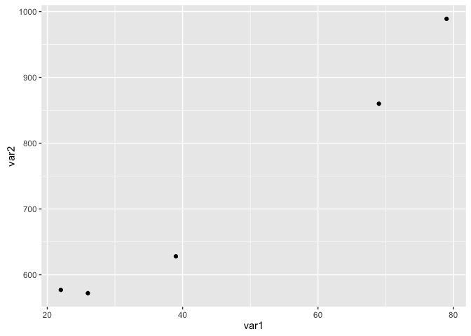
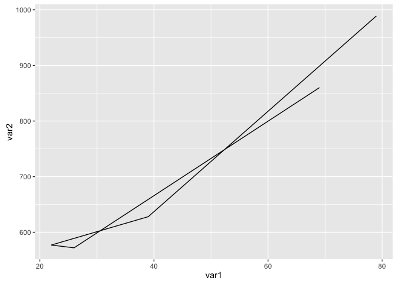
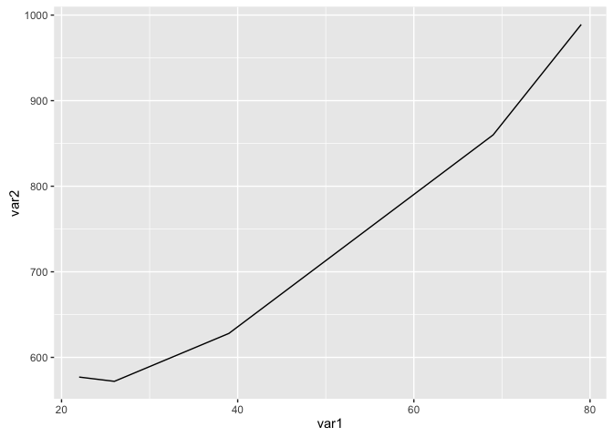
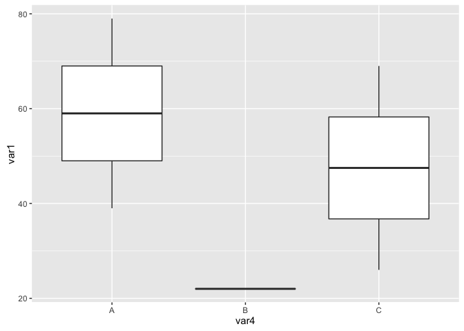
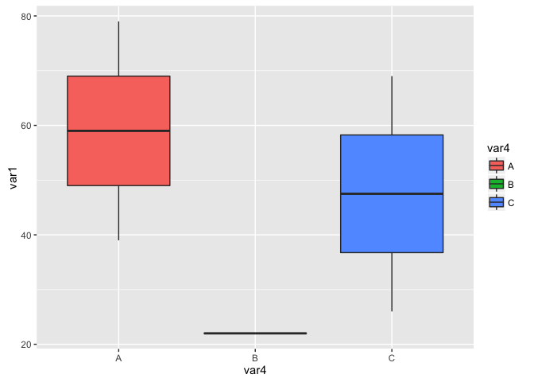
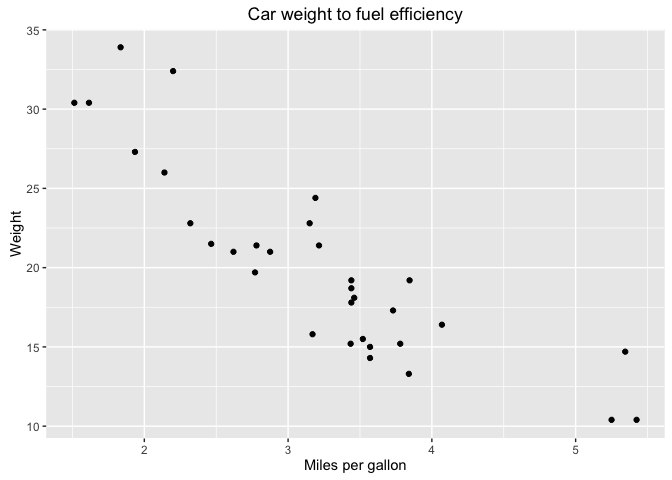
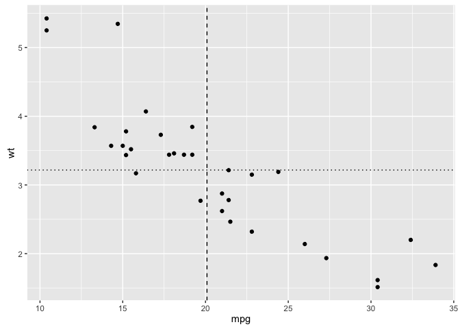

# Intro to ggplot2
Matt O'Donnell  
February 5, 2016  

## ggplot2 - The Grammar of Graphics


```r
library(ggplot2)
```

__ggplot2__ is an implementation of the Grammar of Graphics theory and method of data visualization that builds up plots through layers and components. Data is mapped to particular aesthetics, i.e. which variable in your data set should be mpapped to which element of a plot (e.g. the X and Y axis or a grouping element, such as different lines, colored bars or panels).

Having your data in a data frame is the most natural and straight forward representation for using ggplot2. 

#### This is a __wide__ data frame


```r
df_wide <- data.frame(
  id = paste('p', 1:5, sep=''),
  var1 = sample(1:100, 5),
  var2 = sample(500:1000, 5),
  var3 = sample(1000:10000,5),
  var4 = c('A','A','B','C','C')
)

df_wide
```

```
##   id var1 var2 var3 var4
## 1 p1   79  989 9033    A
## 2 p2   39  628 9699    A
## 3 p3   22  577 7376    B
## 4 p4   26  572 9455    C
## 5 p5   69  860 9149    C
```

## Simple Example: Scatter plot


```r
ggplot(df_wide, aes(x=var1, y=var2)) + geom_point()
```




## The components of a ggplot

### ``ggplot()`` function

* ``ggplot()`` is the main function required in every plot and is usually where you specify the data frame you are plotting and specify the mapping from data to plot element using the ``aes`` (aesthetics) function. 

You can build up the layers of a plot by assigning the result of the ``ggplot`` function to a variable and then adding layers. The following sets up the plot by specifying the data frame and the aesthetics, i.e. which variable should go to which axis in the plot. But it doesn't plot anything.


```r
p <- ggplot(df_wide, aes(x=var1, y=var2))
```

### A __geom__ function

Plots require a __geom__ function to display the data. Examples include:

* ``geom_point()`` - a scatter plot
* ``geom_histogram()`` - a histogram
* ``geom_density()`` - a density plot
* ``geom_bar()`` - a bar chart
* ``geom_boxplot()`` - a box plot
* ``geom_line()`` - a line plot
* ``geom_path()`` - a point to point path line plot (useful for geolocation data etc)
* ``geom_text()`` - a scatter plot with labels instead of points

#### A scatter plot of var1 (x) against var2 (y)


```r
p + geom_point()
```


#### A line plot connecting x,y points


```r
p + geom_line()
```


#### A path line plot connecting x,y points in order


```r
df_wide
```

```
##   id var1 var2 var3 var4
## 1 p1   79  989 9033    A
## 2 p2   39  628 9699    A
## 3 p3   22  577 7376    B
## 4 p4   26  572 9455    C
## 5 p5   69  860 9149    C
```

```r
p + geom_path()
```



If we reorder the data frame the plot will look different.


```r
df2_wide2 <- df_wide[order(df_wide$var1,df_wide$var2),]
p <- ggplot(df2_wide2, aes(x=var1, y=var2))
p + geom_path()
```




#### A bar graph counting the number of items in each group (var4)


```r
p <- ggplot(df_wide, aes(var4)) 
p + geom_bar()
```


#### A boxplot 


```r
p <- ggplot(df_wide, aes(x=var4, y=var1)) 
p + geom_boxplot()
```



You can add aesthetic mappings to the __geom__ function as well to control specific features of the the plot, e.g. the fill color of each boxplot or bar


```r
p + geom_boxplot(aes(fill=var4))
```




```r
p <- ggplot(df_wide, aes(var4))
p + geom_bar(aes(fill=var4))
```


### Graph labels

* ``xlab()`` - specify label for x axis
* ``ylab()`` - specify label for y axis
* ``ggtitle()`` - specify title for graph and legends
* ``labs()`` - set all of the above with parameters in one function


```r
p <- ggplot(mtcars, aes(x=wt, y=mpg))
p + geom_point() +
  xlab('Miles per gallon') +
  ylab('Weight') +
  ggtitle('Car weight to fuel efficiency')
```


is equivalent to


```r
p + geom_point() + 
  labs(x='Miles per gallon', 
       y='Weight',
       title='Car weight to fuel efficiency')
```



### Adding additional aesthetics 

If you have more than two variables you want to represent you can make use of other graphic features such as:

* shape of points
* color of points
* size of points

These can be added as aesthetics to the specific __geom__ function, e.g. to ``geom_point`` for a scatter plot, by including a ``aes`` function


```r
# 1. set up the main mapping from data to x and y axes
p <- ggplot(mtcars, aes(x=mpg, y=wt))

# 2. set up a mapping with the color of points and the number of cylinders (needs to be treated as a factor not an numeric using factor())
p + geom_point(aes(colour=factor(cyl)))
```


```r
# 3. add a fourth dimension for the displacement variable using point size
p + geom_point(aes(colour=factor(cyl), size=disp))
```


```r
# 4. add in nicer labels for title, axes and legends

p + geom_point(aes(colour=factor(cyl), size=disp)) +
  ggtitle('Car relationship between weight and fuel efficency') +
  xlab('Car weight') +
  ylab('Miles per gallon') +
  ggtitle(aes(colour='Cylinders',
              size='Displacement'))
```


### Adding lines to a plot

* ``geom_hline`` - draw a horizontal line on the plot (y axis)
* ``geom_vline`` - draw a vertical line on the plot (x axis)
* ``geom_abline`` - draw 'ab' line with specified slope and y-intercept 

#### Horizontal and vertical lines

Here we add lines to each axis for the mean of the values along that axis (x-axis is __mpg__ and y-axis is __wt__).


```r
p <- ggplot(mtcars, aes(x=mpg, y=wt))

p + geom_point() + 
  # add a vertical line on the x axis for the mean miles per gallon
  geom_vline(aes(xintercept=mean(mpg)), linetype="dashed") +
  # add a horizontal line on the y axis for the mean weight
  geom_hline(aes(yintercept=mean(wt)), linetype="dotted")
```




The ``geom_hline`` and ``geom_vline`` functions can also plot multiple lines, e.g. for the mean of each level of a grouping variable.


```r
# create a data frame of the mean weight and mpg by number of cylinders
# using the aggregate() function
mean_vals <- aggregate(cbind(wt,mpg) ~ cyl, mtcars, mean)
mean_vals
```

```
##   cyl       wt      mpg
## 1   4 2.285727 26.66364
## 2   6 3.117143 19.74286
## 3   8 3.999214 15.10000
```

```r
# draw lines at means
ggplot(mtcars, aes(x=mpg, y=wt, colour=factor(cyl))) +
    geom_point() +
    geom_hline(aes(yintercept=wt, colour=factor(cyl)), 
               mean_vals, linetype='dashed') +
    geom_vline(aes(xintercept=mpg, colour=factor(cyl)), 
               mean_vals, linetype='dotted')
```


#### Regression lines

1. You can specify the _intercept_ and and _slope_ directly using the ``geom_abline`` function:


```r
# fit regression line
md <- lm(wt ~ mpg, mtcars)

# get intercept and slope
coef(md)[1]   # intercept
```

```
## (Intercept) 
##    6.047255
```

```r
coef(md)[2]   # slope
```

```
##       mpg 
## -0.140862
```

```r
p + geom_point() +
    geom_abline(intercept=coef(md)[1],
                slope=coef(md)[2])
```


2. The ``geom_smooth`` function fits a model to the data as part of the plotting process:


```r
p <- ggplot(mtcars, aes(x=mpg, y=wt)) 

p + geom_point() +
    geom_smooth(method='lm')    # lm for linear model
```


Specify the kind of model to be fitted, options include:

* lm
* glm
* gam
* loess
* rlm

see ``?geom_smooth`` help for more details

And can choose to show confidence intervals or not with the ``se`` parameter.


```r
p <- ggplot(mtcars, aes(x=mpg, y=wt)) 

p + geom_point() +
    geom_smooth(method='lm', se=FALSE)    # lm for linear model
```


``geom_smooth`` will fit multiple lines for each grouping factor specified in the main aesthetics.


```r
p <- ggplot(mtcars, aes(x=mpg, y=wt, colour=factor(cyl))) 

p + geom_point() +
    geom_smooth(method='lm', se=FALSE)    # lm for linear model
```


#### Putting it all together in a markedly UN-TUFTE looking chart!


```r
p <- ggplot(mtcars, aes(x=mpg, y=wt, colour=factor(cyl))) 

p + geom_point(aes(size=disp)) +
    geom_smooth(method='lm') +   
    geom_hline(aes(yintercept=wt, colour=factor(cyl)), 
               mean_vals, linetype='dashed') +
    geom_vline(aes(xintercept=mpg, colour=factor(cyl)), 
               mean_vals, linetype='dotted') +
  
    ggtitle('Car relationship between weight and fuel efficency') +
    xlab('Car weight') +
    ylab('Miles per gallon') +
    ggtitle(aes(colour='Cylinders',
                size='Displacement')) +

    theme_bw()
```


